# Mermaid Diagrams

## Basic Usage

````markdown
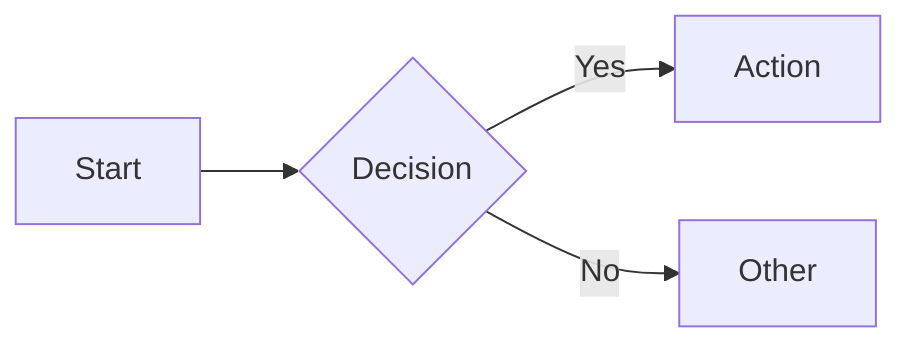
````

## With Configuration

````markdown
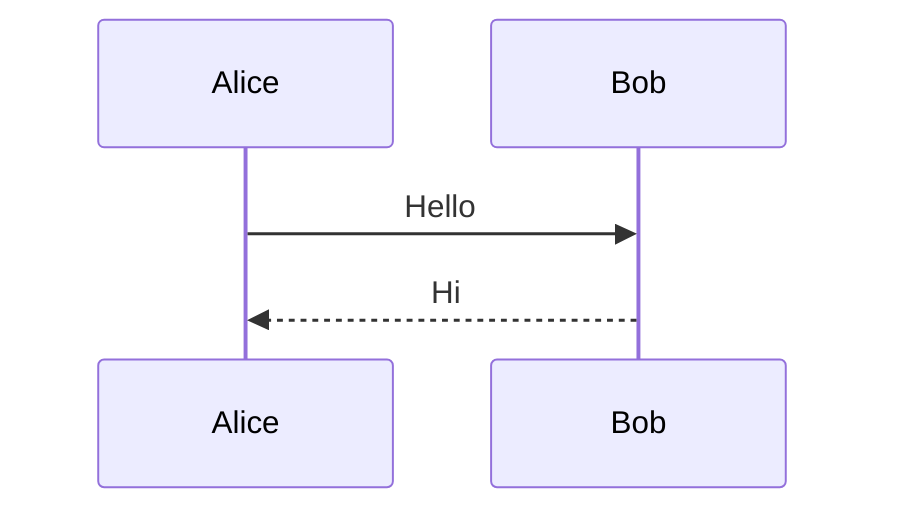
````

## Diagram Types

### Flowchart

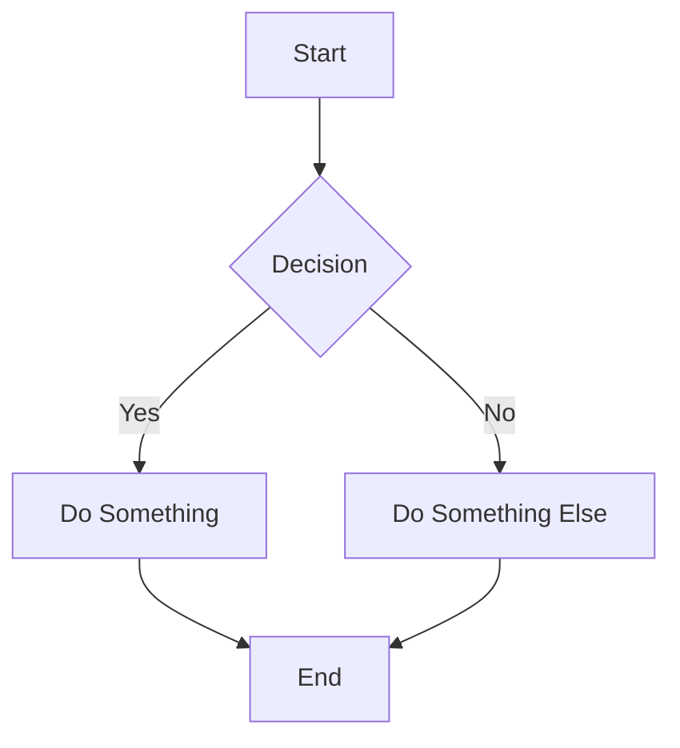

Directions: `TD` (top-down), `LR` (left-right), `BT` (bottom-top), `RL` (right-left)

### Sequence Diagram

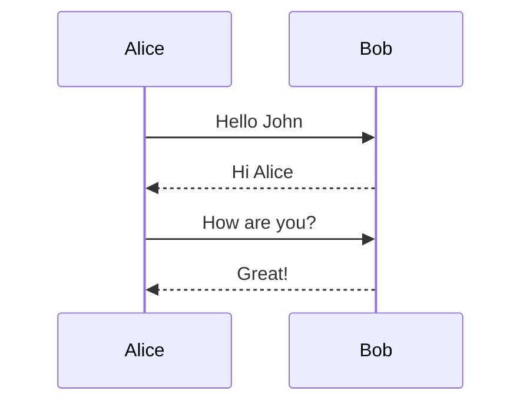

### Class Diagram

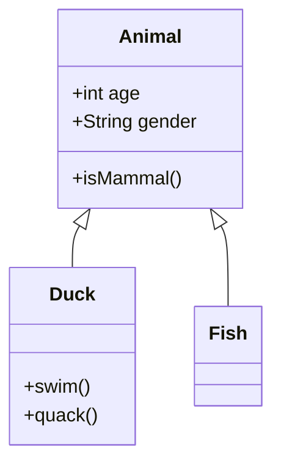

### State Diagram

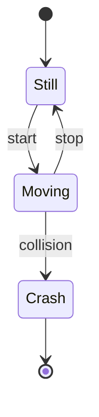

### Entity Relationship

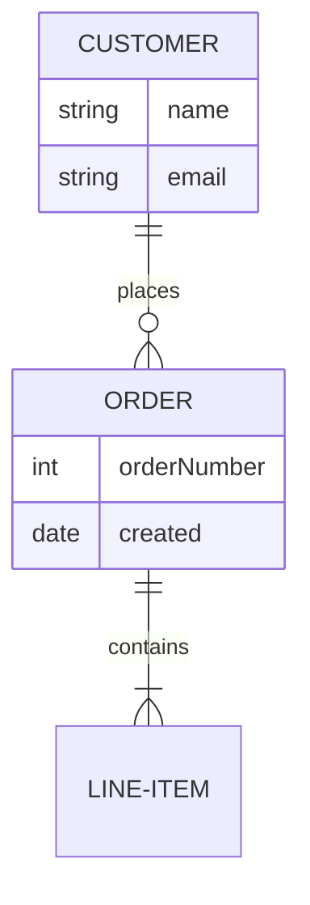

### Gantt Chart

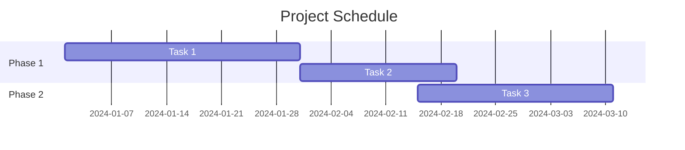

### Pie Chart

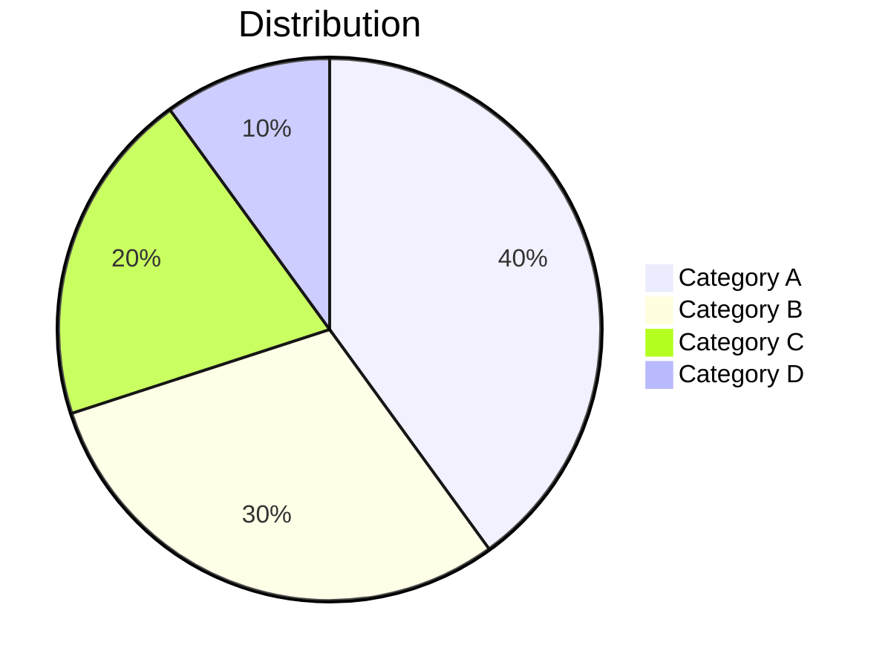

### Git Graph

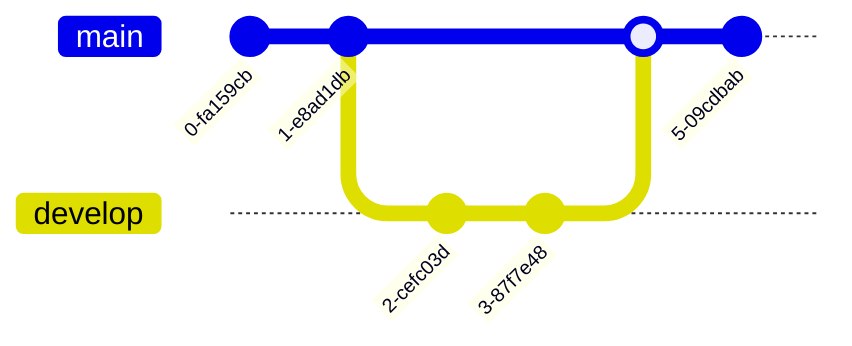

## Configuration Options

| Option | Description | Values |
|--------|-------------|--------|
| `theme` | Diagram theme | `default`, `neutral`, `dark`, `forest` |
| `scale` | Scale factor | `0.5`, `0.8`, `1.0`, etc. |
| `themeVariables` | Custom theme colors | Object with color values |

Example with theme variables:

````markdown
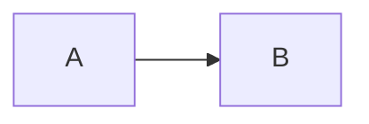
````
