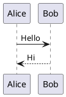
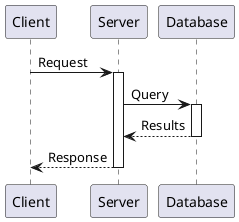
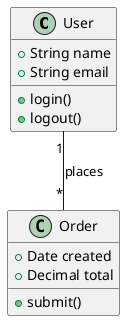
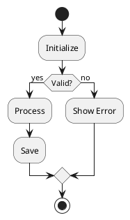
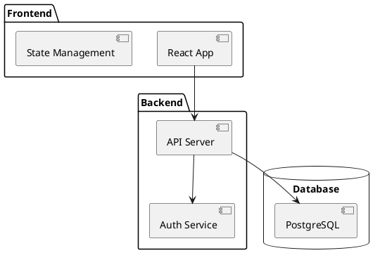
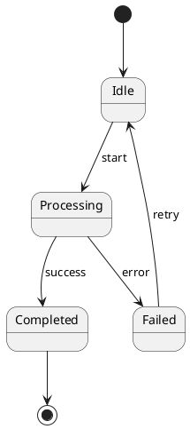

```plantuml
@startuml
skinparam backgroundColor #EEEEEE
skinparam handwritten true

skinparam sequence {
  ArrowColor #333333
  LifeLineBorderColor #666666
  ParticipantBackgroundColor #FFFFFF
}

Alice -> Bob: Styled message
@enduml
```

# PlantUML Diagrams

PlantUML provides UML diagram support beyond Mermaid, with extensive diagram types and customization options.

## Basic Usage

````markdown

````

## Sequence Diagrams

````markdown

````

## Class Diagrams

````markdown

````

## Activity Diagrams

````markdown

````

## Component Diagrams

````markdown

````

## State Diagrams

````markdown

````

## Styling

````markdown

````

## Common Skinparams

| Parameter | Description |
|-----------|-------------|
| `backgroundColor` | Background color |
| `handwritten` | Hand-drawn style |
| `monochrome` | Black and white |
| `shadowing` | Enable shadows |

## When to Use PlantUML vs Mermaid

| Use PlantUML | Use Mermaid |
|--------------|-------------|
| Complex UML diagrams | Simple flowcharts |
| Detailed class relationships | Quick sequence diagrams |
| Activity diagrams with lanes | Gantt charts |
| Deployment diagrams | Git graphs |
| When you need skinparams | When you want simpler syntax |

## Setup

PlantUML requires Java or the PlantUML server. Slidev typically uses the PlantUML server automatically.
