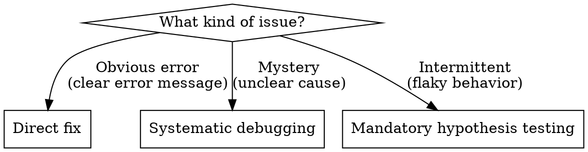

# Systematic Debugging

## Overview

When debugging mysterious issues, structure beats guessing. Systematic debugging makes assumptions explicit, forms testable hypotheses, and verifies methodically.

**Core principle:** Don't pattern-match ("I've seen this before"). Instead, make assumptions visible, form "If X then Y" hypotheses, and design tests that could prove you wrong.

## When to Use



**Use when:**
- Unclear what's causing the failure
- Multiple potential causes
- "It should work but doesn't"
- Behavior is intermittent or flaky
- Tried fixes without understanding why

**Don't use when:**
- Error message is explicit and complete
- Cause is obvious (typo, missing dependency)
- Simple syntax or compilation error

## The Pattern

### 1. Surface Assumptions

Make implicit assumptions explicit:

```
My assumptions:
- Tech stack: [framework/library you're assuming]
- Timing: [async/sync operations]
- Architecture: [how data flows]
- Environment: [dev/prod/test differences]

If any assumption is wrong, the analysis below won't apply.
```

### 2. Form Hypotheses

Convert assumptions to testable hypotheses:

```
Hypothesis: The response isn't being parsed as JSON.

If true, we'd see:
✓ Raw text in network tab response
✓ Parse error in console
✗ NOT seeing parsed object structure

Test by: Check network tab Response vs Preview
```

Template: **"If [cause], then [observable symptoms], NOT [absent symptoms], test by [action]"**

### 3. Experiment

Design minimal tests that could **falsify** your hypothesis:
- Change ONE variable at a time
- State what you're looking for **before** running the test
- Use binary search: divide problem space in half
- Add targeted logging, not shotgun debugging

**Optional:** For complex debugging chains, use the `sequential_thinking` MCP tool to track hypothesis iterations and branching.

### 4. Iterate

- Hypothesis confirmed → Dig deeper in that area
- Hypothesis rejected → Eliminate cause, form new hypothesis
- New information → Update assumptions, form new hypotheses

### 5. Ask User When Stuck

If assumptions are unclear or need more context, ask the user before proceeding.

## Quick Reference

| Situation | Action |
|-----------|--------|
| Don't know where to start | List all assumptions about system state |
| Too many potential causes | Form testable hypothesis for most likely, design falsifiable test |
| "Flaky" or intermittent | Mandatory hypothesis testing - never guess |
| Need code/info | State first: "This will tell us [X], ruling out [Y]" |
| Confident in diagnosis | Ask: "What would prove me wrong?" |

## Common Mistakes

❌ **"Most likely causes are..."** (pattern matching without verification)
✅ List assumptions, then form ONE testable hypothesis

❌ **"Let me debug this systematically" → lists 4 possibilities** (false claim)
✅ Be systematic: pick one hypothesis, test it, iterate

❌ **"Try this to confirm the timing issue"** (exploration disguised as confirmation)
✅ Be honest: "This explores whether timing is involved"

❌ **Making implicit assumptions** (tech stack, async behavior, architecture)
✅ State assumptions explicitly: "I'm assuming you're using fetch. If axios, this differs."

❌ **Shotgun debugging** (add logging everywhere, ask for all code)
✅ Targeted investigation: "To test hypothesis A, I need to see [specific thing]"

## Example

```
Issue: API returns 200 but frontend state doesn't update

❌ BAD (Pattern matching):
"Most likely async/parsing issue. Try adding console.logs everywhere."

✅ GOOD (Systematic):
Assumptions:
- Using fetch API
- State managed with useState
- Response is JSON

Hypothesis: Response isn't reaching the state setter.
If true: Console.log before setState shows data, but state doesn't update
If false: Console.log shows setState not being called at all

Test: Add log immediately before setState call
Result: → Guides next hypothesis
```

## Red Flags - You're Not Being Systematic

- Saying "systematically" but listing multiple possibilities without testing any
- Confident diagnosis before seeing code: "This strongly suggests..."
- Requesting all the code instead of targeted information
- Pattern matching: "Flaky = timing" without verification
- Positioning exploration as "confirmation"

**When you catch these:** Stop. List assumptions. Form ONE hypothesis. Test it.
